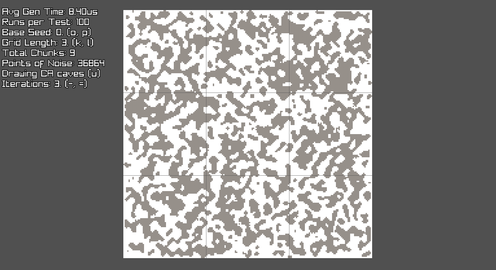

# Binary Cellular Automata for Cave Generation

This repo implements the Cellular Automata (CA) algorithm for cave generation in binary, for a 
massive performance speed-up over the traditional algorithm. 

Normally when generating caves in a voxel game, you generate a float of noise for every single voxel, 
and check if noiseValue > threshold. If so then its set to Air to make a cave. However, this repo
uses columns of uint64_t, and sets each column in a chunk to a random hash. Then the CA algorithm
is applied over multiple iterations with binary neighbor comparisons to get a smooth coherent noise.
To apply the cave noise, you simply read if each bit in the uint64_t is 1 or 0, instead of a threshold check.
The result, is you can have cross-chunk cave noise generation at an order of magnitude faster than existing algorithms.

## Performance Comparison

Benchmarks were performed on an **AMD Ryzen 7 9800X3D**

Below is a comparison between this **Binary CA** implementation and **FastNoise2**'s Simplex Node 
(a highly optimized noise library often used for procedural cave noise generation):

| Points of noise         | Binary CA (2 iterations)          | FastNoise2          | Speed-up          |
|-------------------------|--------------------|---------------------|-------------------|
| 36,864  | 0.10ms | 1.22ms  | 12.2x |
| 102,400 | 0.21ms | 3.07ms  | 14.6x |
| 409,600 | 0.74ms | 12.12ms | 16.4x |

## Images

Visualization is powered by **[raylib](https://www.raylib.com/)**



## Quick Start

```bash
# Clone the repo
git clone https://github.com/Finding-Fortune/Binary-Cellular-Automata.git
cd Binary-Cellular-Automata

# Build
Building can be done through the .\Compile.bat file. Please adjust the cmake
command there to properly build for your machine

# Run
.\Run.bat
```

